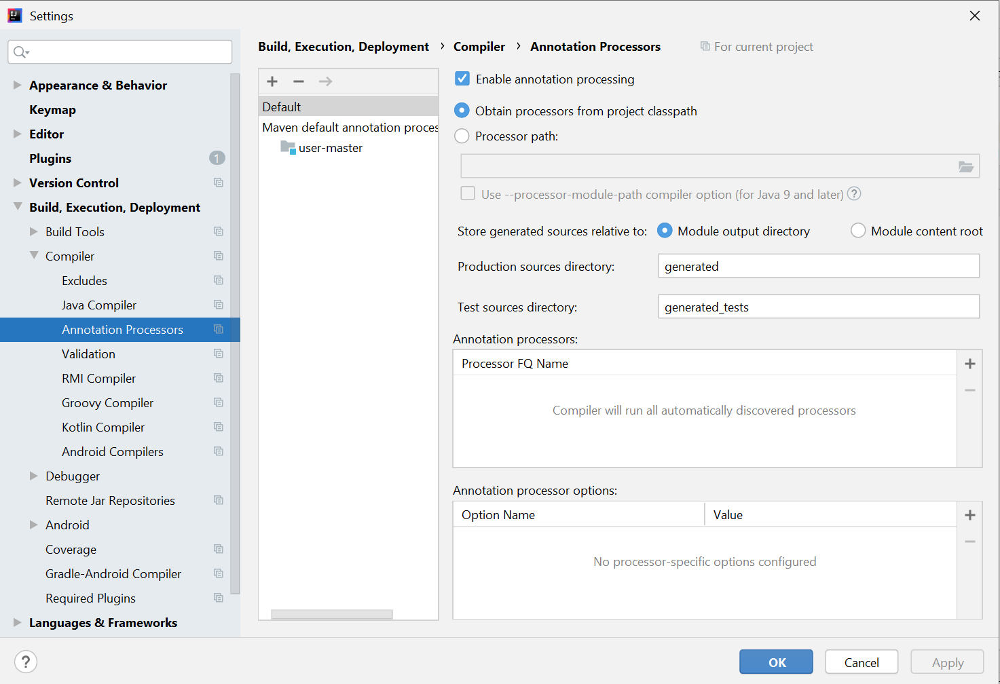

#### Lombok

----------------------------------------------------------------------------------------------------------

**Lombok setup for intillij:**
intillej: https://projectlombok.org/setup/intellij or https://www.baeldung.com/lombok-ide

- [x] install plugin -> lombok -> restart ide

- [x] settings -> build,execution and deployment -> annotation processors -> enable annotation processing

  

